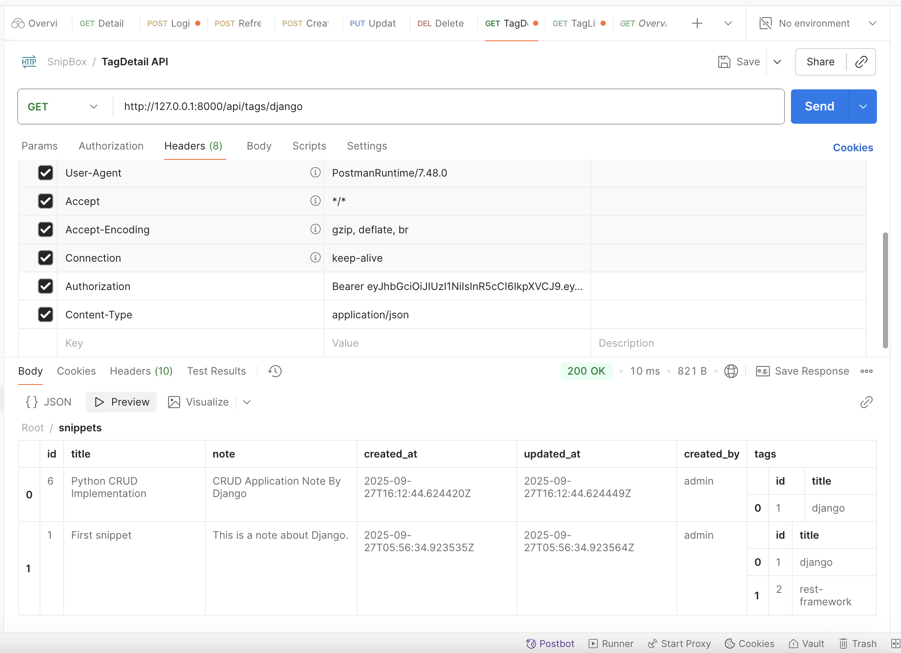

# 📝 SnipBox

SnipBox is a short note saving application with **Django REST Framework** backend and **JWT authentication**.  
Users can save short notes (snippets), categorize them with tags, and perform CRUD operations securely.

---

## 🔑 Features

- JWT-based authentication (login & refresh token)
- Create, Read, Update, Delete snippets
- Tags for grouping snippets
- Snippet listing & overview
- Filter snippets by tags

---

## ⚙️ Requirements
- Python 3.10+
- Django 4.2+ 
- djangorestframework 3.16+
- djangorestframework-simplejwt 5.5+

---

## 📂 Project Structure

```
SnipBoxV2/
|-snipbox              # Django project settings
│   ├── __init__.py    # Project initialization
│   ├── asgi.py        # ASGI application
│   ├── settings.py    # Project settings
│   ├── urls.py        # URL routing
│   └── wsgi.py        # WSGI application

│
├── snippetsapp/       # Snippets app
│   ├── migrations/    # Database migrations
│   ├── models.py      # Database models
│   ├── serializers.py # Data serialization
│   ├── views.py       # API views
│   ├── urls.py        # App URL routing
│   └── tests.py       # Unit tests
│
├── manage.py          # Django management script
└── requirements.txt   # Project dependencies
└── README.md          # Project documentation
└── postman            # Postman collection for API testing
└── results            # API testing results
```
---
## 🛠 Installation & Setup

1. **Clone the repository:**
   ```bash
   git clone https://github.com/Ajay998/SnipBoxV2.git
   cd SnipBoxV2
   ```

2. **Create a virtual environment:**
   ```bash
   python -m venv venv
   source venv/bin/activate  # On Windows use `venv\Scripts\activate`
   ```

3. **Install dependencies:**
   ```bash
   pip install -r requirements.txt
   ```

4. **Apply migrations:**
   ```bash
   python manage.py makemigrations
   python manage.py migrate
   ```
5. **Create a superuser:**
   ```bash
   python manage.py createsuperuser
   ```

6. **Run the development server:**
   ```bash
   python manage.py runserver
   ```

7. **Access the application:**
    Open your browser and navigate to `http://localhost:8000/` to access the API.
    Access the admin panel at `http://localhost:8000/admin/`.
    Login with the superuser credentials you created.
---

## 📑 Database Schema

### **Tag Table**
| Field | Type         | Constraints                  |
|-------|--------------|------------------------------|
| id    | Integer (PK) | Auto Increment               |
| title | Varchar(100) | Unique, Lowercased, Required |

---
### **Snippet Table**
| Field       | Type             | Constraints                        |
|-------------|------------------|------------------------------------|
| id          | Integer (PK)     | Auto Increment                     |
| title       | Varchar(200)     | Required                           |
| note        | Text             | Required                           |
| created_at  | DateTime         | Auto set on create                 |
| updated_at  | DateTime         | Auto set on update                 |
| created_by  | ForeignKey(User) | Required, `on_delete=CASCADE`      |
| tags        | ManyToMany(Tag)  | Optional, Related name → `snippets`|

---

## 📚 API Endpoints
- **Authentication:**
  - `POST /api/token/` - Obtain JWT token
  - `POST /api/token/refresh/` - Refresh JWT token

- **Snippets:**
  - `POST /api/snippets/create/` - Create a new snippet
  - `GET /api/snippets/{id}/` - Detail of specific snippet created by the current user
  - `GET /api/snippets/overview/` - Total count + list all available snippets
  - `DELETE /api/snippets/{id}/delete/` - Delete a specific snippet and return the available snippets
  - `PUT /api/snippets/{id}/update/` - Update a specific snippet and return the updated snippet

- **Tags:**
  - `GET /api/tags/` - List all tags
  - `GET /api/tags/{title}` - Tag Detail Get snippets linked to the selected tag title

---
## 🧪 Testing
Curl commands for testing the API endpoints:
## Authentication APIs
- **Obtain JWT Token:**
  ```bash
  curl -X POST http://localhost:8000/api/token/ -d "username=yourusername&password=yourpassword"
  ```
- **Refresh JWT Token:**
  ```bash
  curl -X POST http://localhost:8000/api/token/refresh/ -d "refresh=your_refresh_token"
  ```
## Snippet APIs
- **Create Snippet:**
  ```bash
  curl -X POST http://localhost:8000/api/snippets/create/ \
  -H "Authorization: Bearer your_jwt_token" \
  -H "Content-Type: application/json" \
  -d '{"title": "Snippet Title", "note": "Snippet note here", "tag_titles": ["tag1", "tag2"]}'
    ```
- **Get Snippet Detail:**
  ```bash
  curl -X GET http://localhost:8000/api/snippets/{id}/ \
  -H "Authorization: Bearer your_jwt_token"
  -H "Content-Type: application/json"
  ```
- **Get Snippet Overview:**
  ```bash
  curl -X GET http://localhost:8000/api/snippets/overview/ \
  -H "Authorization: Bearer your_jwt_token" \
  -H "Content-Type: application/json"
  ```
- **Delete Snippet:**
  ```bash
  curl -X DELETE http://localhost:8000/api/snippets/{id}/delete/ \
  -H "Authorization: Bearer your_jwt_token" \
  -H "Content-Type: application/json"
  ```
- **Update Snippet:**
  ```bash
  curl -X PUT http://localhost:8000/api/snippets/{id}/update/ \
  -H "Authorization: Bearer your_jwt_token" \
  -H "Content-Type: application/json" \
  -d '{"title": "Updated Snippet Title", "note": "Updated snippet note", "tag_titles": ["tag1", "tag2"]}'
  ```
## Tag APIs
- **List All Tags:**
  ```bash
  curl -X GET http://localhost:8000/api/tags/ \
  -H "Authorization: Bearer your_jwt_token" \
  -H "Content-Type: application/json"
  ```
- **Get Tag Detail:**
  ```bash
  curl -X GET http://localhost:8000/api/tags/{title}/ \
  -H "Authorization: Bearer your_jwt_token" \
  -H "Content-Type: application/json"
  ```
## 📦 Postman Collection
Test all APIs with Postman using the included collection.  
[📥 Download Collection](./postman/SnipBox.postman_collection.json)

---
##  Docker Setup

Move to the project directory and run the following commands to build and start the Docker containers:
```bash
docker-compose build
```
```bash
docker-compose up
```
---

## 📸 API Results
### 1. Login API

### 2. Refresh Token API

### 3. Create Snippet API

### 4. Snippet Detail API

### 5. Snippet Overview API

### 6. Delete Snippet API

### 7. Update Snippet API

### 8. List All Tags API

### 9. Tag Detail API
